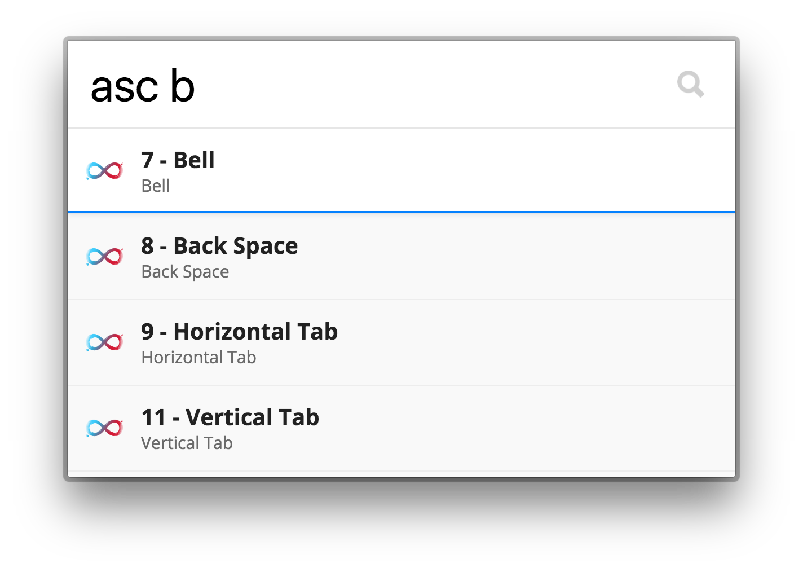

## ASCII Search

Search for ASCII characters by name or by number.

## Usage

Try typing in `asc b` to find characters with the letter `b` inside of them.

## Installing

Add `tinytacoteam/zazu-ascii-calculator` inside of `plugins` block of your  `~/.zazurc.json` file.

~~~ javascript
{
  "plugins": [
    "tinytacoteam/zazu-ascii-search"
  ]
}
~~~

